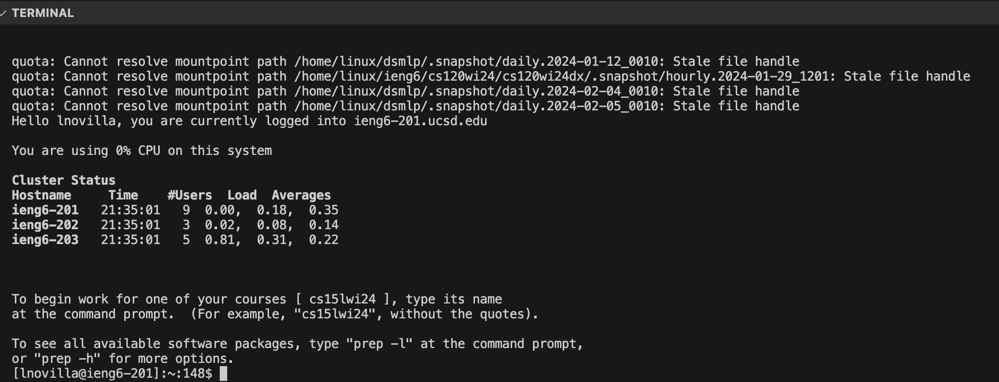
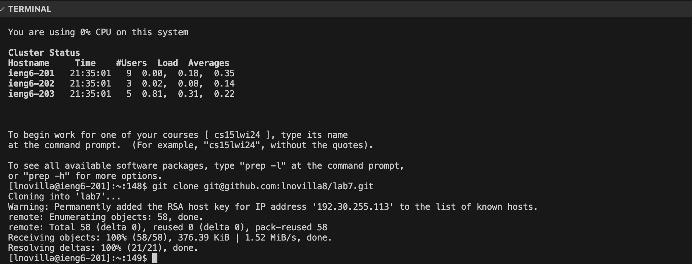
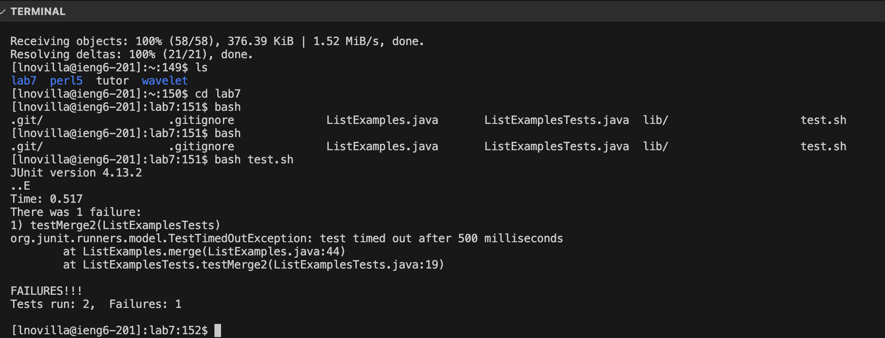
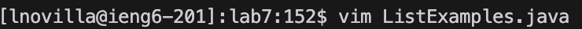
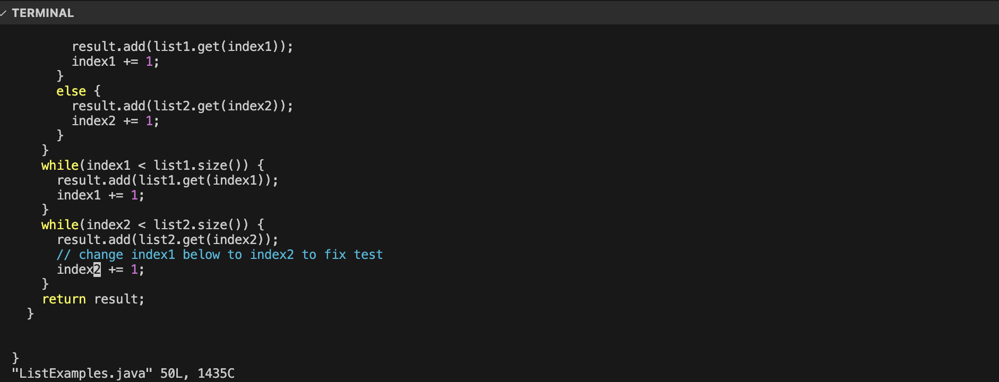
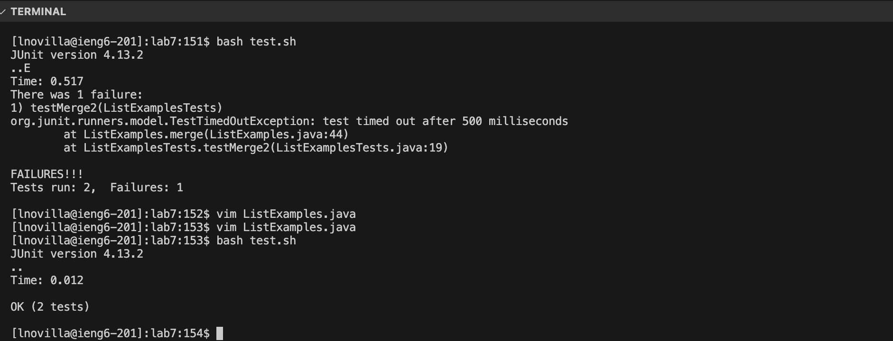

# Lab Report 4
## Step 4:

```ssh lnovilla@ieng6.ucsd.edu <enter>``` to enter in command to log into ieng6

## Step 5:

```git clone git@github.com:lnovilla8/lab7.git <enter>``` to execute command to clone fork of lab7 repository from Github server into ieng6.

## Step 6:

Used ```cd lab7 <enter>``` to change current directory into lab7 folder that was cloned to access test repository files. Ran ```bash test.sh <enter>```,enter to execute command line, bash executes the shell script which contains code to compile and execute the test methods in ```ListExamplesTests.java```.

## Step 7:



Error is that in merge method's 3rd while loop, ```index1``` is being incremented instead of ```index2``` for ```list2```. Executed ```vim ListExamples.java <enter>``` to be able to edit file. Typed ```43j``` to go down 43 lines to get onto the 44th line. Pressed ```e``` to get the cursor onto the end of the current word, moving the cursor onto ```"1"```, pressed ```<shift> R``` to go into replace mode, typed 2 to replace ```index1``` into ```index2```, pressed ```<esc>``` to go into normal mode. Finished by typing ```:wq!``` to save changes and close file.

## Step 8:

Re-ran tests by running ```bash test.sh <enter>``` to execute bash script. Both tests successfully passed.

## Step 9:

Ran ```git add . <enter>``` to add all changes to the current directory lab7 to the stage. Executed ```git commit -m "Changed index1 to index2" <enter>``` to commit all changes from the local repository to the Git server with message. Finally ran ```git push origin main <enter>``` execute command to push committed changes in lab7 directory from local main branch to repository main branch on Github.
